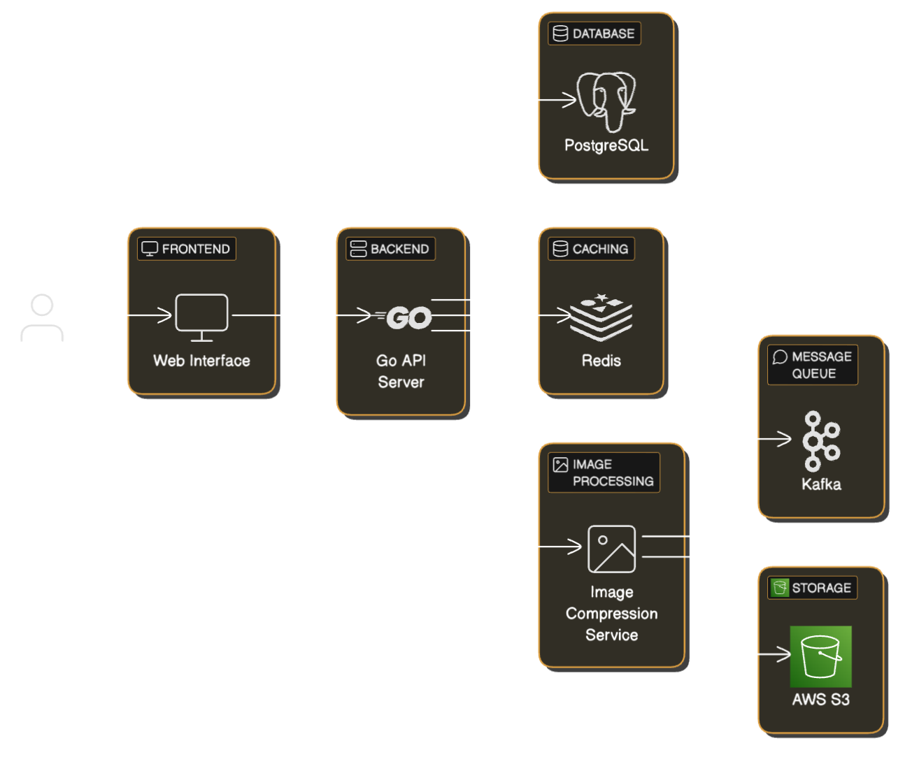

# Golang Application using S3, Kafka, Redis and PostgreSQL for Product Management

This is a product management application that allows users to manage products, including uploading and compressing product images, storing them in AWS S3, and caching product data in Redis. The application is built using Go, Gin, GORM, Kafka, and Redis.

## Video Demo

[](https://share.vidyard.com/watch/6zbmzGzkTwnb6Zn3oMi2ML?)

## Architecture



## Directory Structure

```
zocket/
├── cmd/
│   ├── api/
│   │   └── main.go
│   └── processor/
│       └── main.go
├── config/
│   └── config.go
├── internal/
│   ├── api/
│   │   ├── handlers.go
│   │   ├── handlers_test.go
│   │   └── routes.go
│   ├── cache/
│   │   └── redis.go
│   ├── db/
│   │   ├── database.go
│   │   ├── models.go
│   ├── logger/
│   │   └── logger.go
│   ├── queue/
│   │   ├── consumer.go
│   │   ├── processor.go
│   │   ├── producer.go
├── pkg/
│   └── util/
│       └── image.go
├── tests/
│   ├── integration/
│   │   └── api_test.go
│   ├── performance/
│   │   └── api_bench_test.go
│   └── testutils/
│       └── mocks.go
├── .dockerignore
├── .env
├── .gitignore
├── Dockerfile
├── Makefile
├── README.md
├── docker-compose.yml
├── go.mod
├── go.sum
```

## Prerequisites

- Go 1.21.0 or later
- Docker and Docker Compose
- PostgreSQL
- Kafka
- Redis
- AWS S3

## Running the Application

### Without Docker

1. **Clone the repository:**

    ```sh
    git clone https://github.com/mohammadshaad/zocket.git
    cd zocket
    ```

2. **Set up environment variables:**

    Create a `.env` file in the root directory with the following content:

    ```env
    # PostgreSQL
    DATABASE_DSN=host=localhost user=postgres password=postgres dbname=product_management port=5432 sslmode=disable TimeZone=Asia/Kolkata

    # Kafka
    KAFKA_BROKERS=localhost:9092
    KAFKA_TOPIC=image_processing
    KAFKA_GROUP_ID=image_processor_group

    # S3
    AWS_REGION=eu-north-1
    S3_BUCKET=shaad-my-product-images-bucket
    AWS_ACCESS_KEY_ID=YOUR_AWS_ACCESS_KEY_ID
    AWS_SECRET_ACCESS_KEY=YOUR_AWS_SECRET_ACCESS_KEY

    # Redis
    REDIS_ADDR=localhost:6379
    REDIS_PASSWORD=YOUR_REDIS_PASSWORD
    REDIS_USERNAME=default
    ```

3. **Install dependencies:**

    ```sh
    go mod download
    ```

4. **Run the API server:**

    ```sh
    go run cmd/api/main.go
    ```

5. **Run the Kafka processor:**

    ```sh
    go run cmd/processor/main.go
    ```

### With Docker

1. **Clone the repository:**

    ```sh
    git clone https://github.com/mohammadshaad/zocket.git
    cd zocket
    ```

2. **Build and run the Docker containers:**

    ```sh
    docker-compose up --build
    ```

## Running Tests

### Unit Tests

To run unit tests:

```sh
make unit
```

### Integration Tests

To run integration tests:

```sh
make integration
```

### Benchmark Tests

To run benchmark tests:

```sh
make benchmark
```

### Clean Up

To clean up temporary test files or artifacts:

```sh
make clean
```

## Project Structure

- **cmd/**: Contains the entry points for the API server and Kafka processor.
- **config/**: Contains configuration loading logic.
- **internal/**: Contains the core application logic, including API handlers, database models, caching, and queue processing.
- **pkg/**: Contains utility functions.
- **tests/**: Contains integration and performance tests, as well as test utilities.

## API Endpoints

- **POST /api/v1/products**: Add a new product.
- **GET /api/v1/products/:id**: Get a product by ID.
- **GET /api/v1/products**: Get all products with optional filters.

## Environment Variables

- **DATABASE_DSN**: PostgreSQL connection string.
- **KAFKA_BROKERS**: Kafka brokers.
- **KAFKA_TOPIC**: Kafka topic for image processing.
- **KAFKA_GROUP_ID**: Kafka consumer group ID.
- **AWS_REGION**: AWS region.
- **S3_BUCKET**: AWS S3 bucket name.
- **AWS_ACCESS_KEY_ID**: AWS access key ID.
- **AWS_SECRET_ACCESS_KEY**: AWS secret access key.
- **REDIS_ADDR**: Redis address.
- **REDIS_PASSWORD**: Redis password.
- **REDIS_USERNAME**: Redis username.

## License

This project is licensed under the MIT License.
